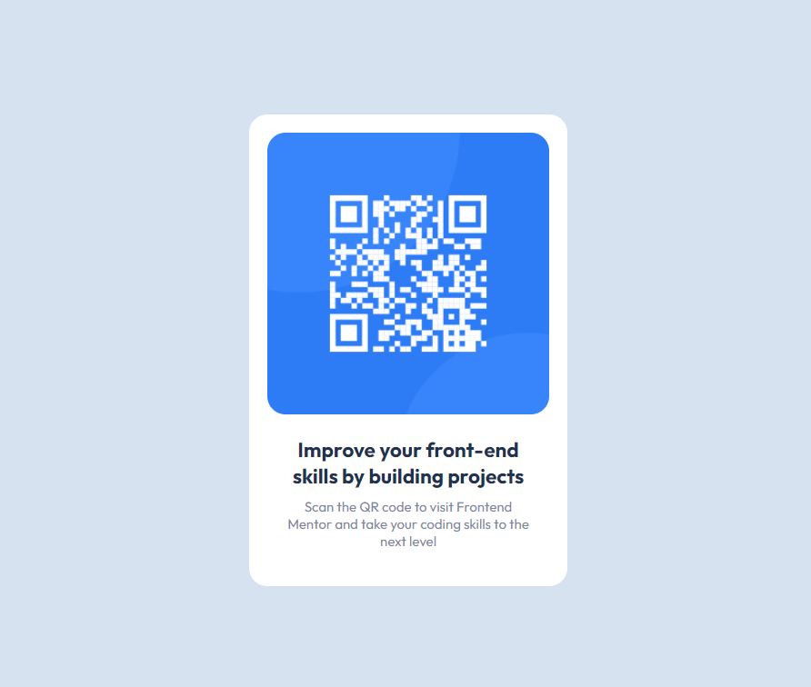

# Frontend Mentor - QR code component solution

This is a solution to the [QR code component challenge on Frontend Mentor](https://www.frontendmentor.io/challenges/qr-code-component-iux_sIO_H). Frontend Mentor challenges help you improve your coding skills by building realistic projects.

## Table of contents

- [Overview](#overview)
  - [Screenshot](#screenshot)
  - [Links](#links)
- [My process](#my-process)
  - [Built with](#built-with)
  - [What I learned](#what-i-learned)
  - [Continued development](#continued-development)
- [Author](#author)

## Overview

### Screenshot



### Links

- Solution URL: (https://github.com/KingCoder-dev/QR-code_frontend_mentor.git)
- Live Site URL: (https://kingcoder-dev.github.io/QR-code_frontend_mentor/)

## My process

After typing up the html, I made my variables and global styling then proceeded to centering the card using flexbox and did the necessary styling for each element.

### Built with

- Semantic HTML5 markup
- CSS custom properties
- Flexbox

### What I learned

I learn to effectively use margin auto to properly center a div , using rem for font size, and variables in root

To see how you can add code snippets, see below:

```css
.:root{
--White: hsl(0, 0%, 100%);
--Lightgray: hsl(212, 45%, 89%);
--Grayishblue: hsl(220, 15%, 55%);
--Darkblue: hsl(218, 44%, 22%);
}

### Continued development

i want to improve on structuring my html properly further my skills in css by improving on flexbox and sizing and media queries.

## Author

- Frontend Mentor - [@KingCoder-dev](https://www.frontendmentor.io/profile/KingCoder-dev)

**Note: Delete this note and add/remove/edit lines above based on what links you'd like to share.**

```
